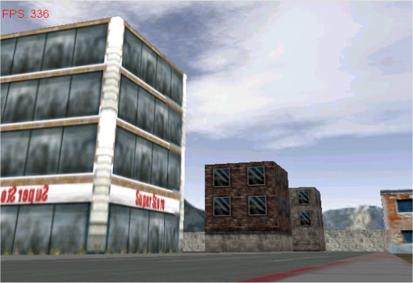



## little 3D city game Tutorial \#7 on How to make 3d scene with NemoX 3D engine

### Description

This demo shows how to make 3d scene trought NemoX directx 8.1 3D engine.

this sample come with the tutorial series on the NemoX engine web site

http://perso.wanadoo.fr/malakoff/index.htm

I could not upload the demo with sourcecode on PSC

so you can download it at

http://perso.wanadoo.fr/malakoff/Tutorials/tut7.htm

To make it work the NemoX engine must be installed

download it here:

http://perso.wanadoo.fr/malakoff/NemoXsetup.exe

Any problems,bugs let me know by posting

Feedbacks..
 
### More Info
 

             |
---                |---
**Submitted On**   |2002-12-05 11:06:04
**By**             |[polaris](https://github.com/Planet-Source-Code/PSCIndex/blob/master/ByAuthor/polaris.md)
**Level**          |Advanced
**User Rating**    |5.0 (10 globes from 2 users)
**Compatibility**  |VB 4\.0 \(32\-bit\), VB 5\.0, VB 6\.0
**Category**       |[DirectX](https://github.com/Planet-Source-Code/PSCIndex/blob/master/ByCategory/directx__1-44.md)
**World**          |[Visual Basic](https://github.com/Planet-Source-Code/PSCIndex/blob/master/ByWorld/visual-basic.md)
**Archive File**   |[little\_3D\_1508271252002\.zip](https://github.com/Planet-Source-Code/polaris-little-3d-city-game-tutorial-7-on-how-to-make-3d-scene-with-nemox-3d-engine__1-41328/archive/master.zip)

